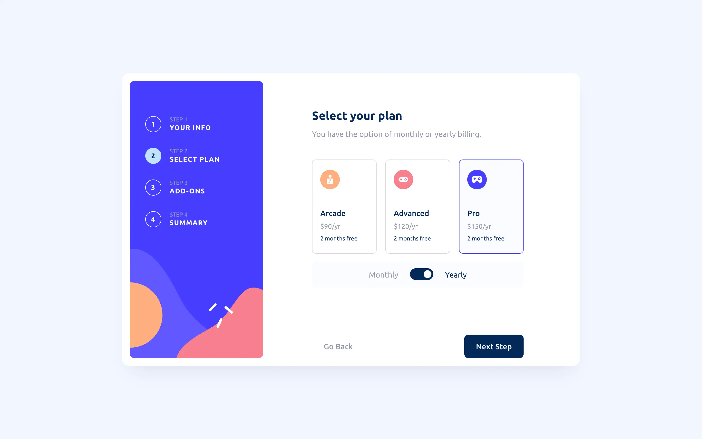
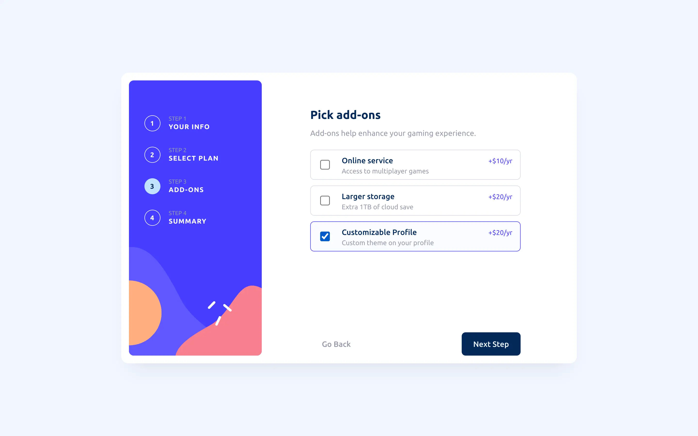

# Frontend Mentor - Challenge

Live on Github Pages: https://jefcooper.github.io/fem-multi-step-form

This is a solution to the [Multi-step form challenge on Frontend Mentor](https://www.frontendmentor.io/challenges/multistep-form-YVAnSdqQBJ). Frontend Mentor challenges help you improve your coding skills by building realistic projects.

## Table of contents

- [Overview](#overview)
  - [The challenge](#the-challenge)
  - [Screenshot](#screenshot)
  - [Links](#links)
- [My process](#my-process)
  - [Built with](#built-with)
  - [What I learned](#what-i-learned)
  - [Continued development](#continued-development)
  - [Useful resources](#useful-resources)
- [Author](#author)
- [Acknowledgments](#acknowledgments)

## Overview

### The challenge

### Screenshots

### Links

- Solution URL: [Github Repository](https://github.com/jefcooper/fem-multi-step-form)
- Live Site URL: [Github Pages](https://jefcooper.github.io/fem-multi-step-form)

## My process

### Built with

- Semantic HTML5 markup
- CSS custom properties
- Flexbox
- CSS Grid
- Mobile-first workflow
- Github Actions
- Github Pages
- npm / vite

### What I learned

- There are a couple of main camps, one is using DOM manipulation to attach template fragments to a div. The other is one wide form where pages get scrolled into view like a carousel.
- The carousel approach has some drawbacks in that page visibility needs to be carefully managed.
- Fromm the W3 Schools page, it appears the carousel approach requires managing the display property on tabs and display: none on tabs that are off screen. This doesn't affect form state and no data is lost when submitting the form. Data from hidden tabs is still sent.
- The W3 approach lacks the ability to show a side-scrolling animation, however, this can be fixed up by watching for the animationend event and setting display: none once the animated scroll out of view is completed.
- Can force native form validation through javascript

### Outline of Chosen Approach

1. Use a multiple tab approach where each tab is a <section> within a form
2. Use data- attributes to attach script to the form and buttons to manipulate state

### Todo

- ~~Toggle switch needs work to highlight monthly / yearly. Need to change around the labels so they all follow the input checkbox. Since the visible slider is a label, this should be possible.~~
- ~~Fix up typography, it's gotten away from me!~~
- Custom checkbox so that it can have purple color. (leaving it blue for now)
- ~~Field validation on Your Info page~~
- ~~Finishing Up page, need to generate plan summary text and figure out how this interacts with FormData.~~
- ~~Figure out what to do on Confirm, do I really post or not?~~Fixed, no buttons shown on Thank You, confirm on second last page. Posting left as an exercise, but can be done programmatically on click.

### Bugs and Finishing Steps

- focus on checkbox is now showing, need to hide that because we're showing custom focus on label instead.

### Design Alterations

- the original design specifies cursor: pointer when hovering on text input. This overrides the system i-beam cursor that is required for exact placement of cursor when editing... so I did not follow the design for this.

### Useful resources

- https://www.youtube.com/watch?v=FKIafz8qgpk
- https://www.youtube.com/watch?v=UldBI0fdMJw&t=0s
- https://www.w3schools.com/howto/howto_js_form_steps.asp
- https://www.w3.org/WAI/tutorials/forms/multi-page/
- https://a11y-guidelines.orange.com/en/articles/using-aria-current-attribute/
- https://developer.mozilla.org/en-US/docs/Web/API/HTMLFormElement/reportValidity

#### Tooling

- https://www.joshwcomeau.com/css/custom-css-reset/
- https://svg-sprite-generator.vercel.app/
- https://medium.com/swlh/better-ways-to-organise-css-properties-9a066e7ded62

#### Unsplash

#### My Codepens

## Author

- Website - [Jeff Cooper](https://jefcooper.github.io)
- Frontend Mentor - [@jefcooper](https://www.frontendmentor.io/profile/jefcooper)

## Acknowledgments
